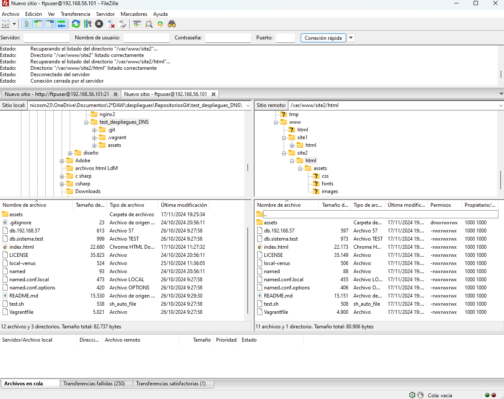

# Configuración de un Servidor Web con Nginx y FTP Seguro

## **Introducción**

En esta práctica configuré un servidor web con Nginx en una máquina virtual Debian a través de Vagrant. El objetivo era alojar dos sitios web:

1. Uno utilizando **Git** para descargar los archivos.
2. Otro configurado para recibir archivos mediante **FTPES** (FTP seguro).

---

## **Preguntas Frecuentes**

### **¿Qué pasa si no hago el enlace simbólico entre `sites-available` y `sites-enabled` de mi sitio web?**

Si no creo el enlace simbólico entre `sites-available` y `sites-enabled`, Nginx no reconocerá el sitio y no lo servirá. Es como si configurara un sitio web, pero no le diera la "llave" para que Nginx lo lea. Solo habría creado el archivo de configuración, pero Nginx no lo cargaría, por lo que el sitio no estaría disponible para los usuarios.

**Solución:**  
Crear el enlace simbólico, lo que permite que Nginx "active" el sitio. Sin este enlace, aunque la configuración sea correcta, el servidor web no podrá servir el sitio.

---

### **¿Qué pasa si no le doy los permisos adecuados a `/var/www/nombre_web`?**

Si no doy los permisos correctos a los archivos de mi sitio web, estaré bloqueando el acceso de Nginx a esos archivos.  
Nginx necesita al menos **permisos de lectura** sobre los archivos del sitio para servirlos cuando un usuario los solicite. Si no tiene esos permisos, pueden aparecer errores como:

- **403 Forbidden:** Indica que el servidor no puede acceder a los archivos, aunque los haya encontrado.

Además, si los permisos no son los adecuados, podría comprometer la **seguridad del servidor**, permitiendo que otros usuarios accedan o modifiquen los archivos del sitio.

**Recomendación:**  
El propietario del directorio debe ser `www-data`, que es el usuario con el que trabaja Nginx.

---

## **Pasos de Configuración**

### **Configuración de Nginx**

1. **Clonación de repositorios:**  
   Cloné los sitios web desde GitHub y sincronicé los archivos en las carpetas:  
   - `/var/www/site1`
   - `/var/www/site2`

2. **Configuración de sitios web:**  
   - Creé los archivos de configuración necesarios en `/etc/nginx/sites-available/`.  
   - Habilité los sitios mediante enlaces simbólicos en `/etc/nginx/sites-enabled/`.  
   - Comprobé la configuración y recargué Nginx:

     ```bash
     sudo ln -s /etc/nginx/sites-available/site1 /etc/nginx/sites-enabled/
     sudo ln -s /etc/nginx/sites-available/site2 /etc/nginx/sites-enabled/
     sudo nginx -t
     sudo systemctl reload nginx
     ```

3. **Resolución de problemas:**  
   - Al modificar el archivo `/etc/hosts` en Windows, tuve que guardar los cambios con permisos de administrador.  
   - Una vez resuelto, todo funcionó correctamente.

---

### **Configuración de FTPES**

1. **Instalación de vsftpd:**  
   Instalé y configuré `vsftpd` para habilitar FTP seguro (FTPES) en el puerto 21.

2. **Configuración de usuario:**  
   Creé un usuario FTP y configuré permisos para que solo pudiera acceder a los archivos en `/var/www/site2`.  

   ```bash
   sudo useradd -m ftpuser
   sudo passwd ftpuser
   sudo chown -R ftpuser:ftpuser /var/www/site2
## **Problemas Encontrados y Soluciones**

### **Enlace simbólico no creado**  
Sin el enlace simbólico entre `sites-available` y `sites-enabled`, Nginx no podía servir uno de los sitios.  

**Solución:**  
Creé los enlaces simbólicos correspondientes.

### **Permisos incorrectos**  
Al inicio, los permisos de los archivos no permitían que Nginx accediera a ellos, lo que generaba errores **403 Forbidden**.  

**Solución:**  
Configuré los permisos adecuados y me aseguré de que el propietario del directorio fuera `www-data`.

---

Logré configurar satisfactoriamente el ftpes y enviar los archivos desde el directorio local al de la máquina virtual



## **Conclusión**

En esta práctica aprendí a:

- Configurar un servidor web completo con Nginx.  
- Manejar permisos correctamente para garantizar que Nginx pueda acceder a los archivos del sitio.  
- Habilitar FTP seguro para la transferencia de archivos.  

---

**Autor:**  
Nicolás Sánchez  
[@nicosm23gh](https://github.com/nicosm23gh)